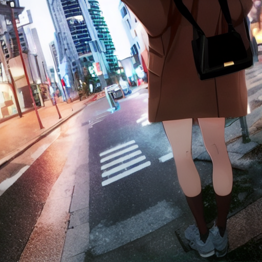
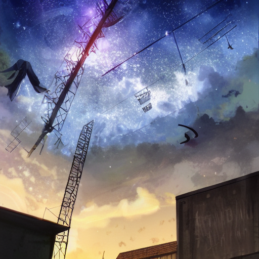
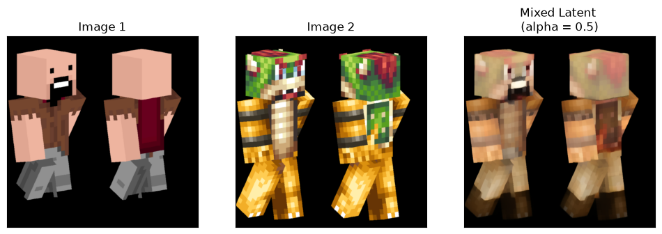
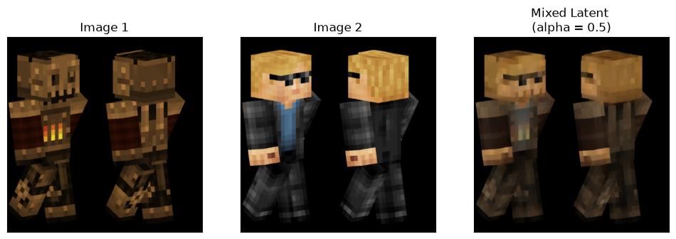
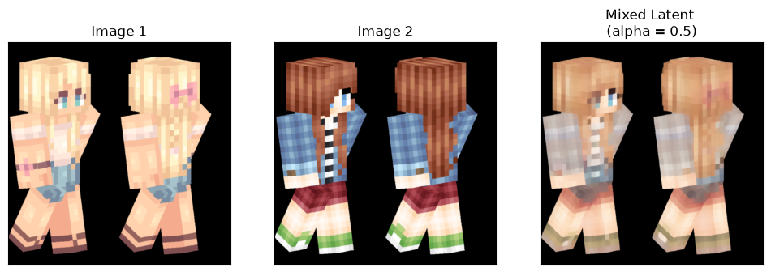

# Mini Stable Diffusion from Scratch

一个基于 PyTorch 从零实现的 **Stable Diffusion v1.x** 学习项目，包含完整的 VAE、CLIP 文本编码器、UNet 扩散模型、DDPM/DDIM 采样器，以及可交互的 Gradio WebUI，适合学习扩散模型架构或进行小规模微调实验。

> **声明**：本项目为教育性质实现，核心模块均从零手写，不依赖 `diffusers`、`stable-diffusion-webui` 等现成框架，便于理解 SD 的每个组件及训练过程。

---

## 目录

- [Mini Stable Diffusion from Scratch](#mini-stable-diffusion-from-scratch)
  - [目录](#目录)
  - [核心特性](#核心特性)
  - [快速开始](#快速开始)
  - [项目结构](#项目结构)
  - [环境要求](#环境要求)
  - [安装](#安装)
  - [模型架构](#模型架构)
  - [推理](#推理)
    - [通过 Jupyter Notebook](#通过-jupyter-notebook)
    - [通过 Gradio WebUI](#通过-gradio-webui)
  - [训练](#训练)
    - [数据集准备](#数据集准备)
    - [Diffusion (UNet) 训练](#diffusion-unet-训练)
    - [VAE 训练](#vae-训练)
  - [注意事项与限制](#注意事项与限制)
  - [致谢](#致谢)
  - [许可证](#许可证)

---

## 核心特性

- **模型支持**：可支持大多数带有 VAE 的 **SD 1.0 / SD 1.5** 社区模型，`.safetensors`  权重文件放入 `model/` 目录下。
- **从零实现核心组件**：VAE Encoder/Decoder、CLIP Text Encoder、UNet 扩散模型、Self/Cross Attention、Time Embedding。
- **手动实现Pipline**：涵盖文本提示编码、时间步调度、无分类器引导（CFG）、扩散反向采样等关键环节，串联各核心组件完成端到端图像生成。
- **权重加载**：在最小化架构改动、尽可能便于理解的原则下，仅简单变换官方权重键值对，即可完成核心组件权重配对。
- **简易训练流程**：支持分阶段训练 VAE 与 Diffusion UNet，支持从 SD 官方权重加载预训练权重微调。
- **采样器**：内置 DDPM 与 DDIM 采样器，支持文生图（text-to-image）与图生图（image-to-image）。
- **交互方式**：
  - `train.ipynb`：Jupyter Notebook 训练与可视化调试。
  - `webui.py`：基于 Gradio 的图形化生成界面。

---

## 快速开始

```bash
# 1. 克隆项目
git clone https://github.com/MataoranYay/mini-stable-diffusion-from-scratch.git
cd mini-stable-diffusion-from-scratch

# 2. 创建虚拟环境并安装依赖
python -m venv .venv
# Windows
.venv\Scripts\activate
# Linux / macOS
source .venv/bin/activate

pip install -r requirements.txt

# 3. 下载 SD v1.5 基础权重到 model/ 目录
# 如：model/base-v1-5-pruned-emaonly.safetensors

# 4. 启动 WebUI
python webui.py
```

---

## 项目结构

```
mini-stable-diffusion-from-scratch/
│
├── checkpoint/                 # 训练保存的检查点
├── dataset/                    # 训练数据集目录
├── image/                      # 生成图像保存位置
├── model/                      # 存放完整 safetenors 模型
│
├── module/                     # 核心模型模块
│   ├── clip.py                 # CLIP 文本编码器
│   ├── diffusion.py            # UNet 扩散模型
│   ├── model_loader.py         # 权重加载工具
│   ├── pipeline.py             # 文生图 / 图生图推理管道
│   ├── vae.py                  # VAE Encoder / Decoder
│   └── samplers/               # 采样器
│       ├── sampler.py          # 基础采样器（加噪 / 去噪）
│       ├── ddpm.py             # DDPM 采样器
│       └── ddim.py             # DDIM 采样器
|
├── tokenizer/                  # CLIP tokenizer 文件
│   ├── vocab.json
│   └── merges.txt
│
├── trainer/                    # 训练器
│   ├── dataset.py              # ImageTextDataset
│   ├── train_vae.py            # VAE 训练器
│   └── train_diffusion.py      # Diffusion 训练器
│
├── LICENSE                     # 开源许可（MIT）
├── README.md                   # 本文件
├── demo.ipynb                  # 推理演示 Notebook
├── requirements.txt            # Python 依赖
├── train.ipynb                 # 训练与推理 Notebook
└── webui.py                    # 推理 WebUI 入口
```

---

## 环境要求

| 项目 | 推荐配置 |
|------|---------|
| 操作系统 | Windows 10/11 / Linux |
| Python | 3.10 ~ 3.12 |
| PyTorch | 2.12.1 |
| CUDA | 建议12.x 或更高 |
| GPU 显存 | 训练 512×512 建议 ≥ 16 GB；推理 512×512 建议 ≥ 8 GB |
| 训练显卡 | NVIDIA GeForce RTX 5090 |

---

## 安装

1. 创建并激活虚拟环境：

```bash
python -m venv .venv
.venv\Scripts\activate  # Windows
# source .venv/bin/activate  # Linux/macOS
```

2. 安装依赖：

```bash
pip install -r requirements.txt
```

主要依赖包括：

```text
gradio==6.26.0
ipython==8.12.3
lpips==0.1.4
matplotlib==3.11.1
numpy==2.5.2
Pillow==12.3.0
safetensors==0.8.0
torch==2.12.1
torchvision==0.28.0
tqdm==4.70.0
transformers==5.12.1
```

3. 下载 Stable Diffusion v1.5 官方基础权重： [stable-diffusion-v1-5 · 模型库](https://www.modelscope.cn/models/AI-ModelScope/stable-diffusion-v1-5)（推荐`v1-5-pruned-emaonly.safetensors`，CLIP 分词器配置文件已在`tokenizer/`目录下）并放置到 `model/` 目录下，用于初始化 CLIP、VAE 与 Diffusion。
3. （可选）下载本项目在开源数据集 [Anime-Background-Finetuning-V1.1](https://huggingface.co/datasets/RicemanT/Anime-Background-Finetuning-V1.1) 上微调的模型 [Anime-Background-Finetuning-diffusion](https://www.modelscope.cn/models/MataoranYay/Anime-Background-Finetuning-diffusion) ，或其他任意 **SD 1.0/SD 1.5** 社区模型（需包含 VAE 权重），下载完成后同样放置在`model/` 目录下。

---


## 模型架构

* **vae.py**：封装了 **变分自编码器 （Variational Auto-Encoder, VAE）**，对编码器类 `VAE_Encoder` 和解码器类`VAE_Decoder `独立封装，实例化或权重加载时二者分开进行。

* **clip.py**：封装了 OpenAI 的 **对比语言-图像预训练模型 （Contrastive Language-Image Pretraining, CLIP）**中的 **文本编码器**，由于不考虑 CLIP 模型的训练，因此没有对图像编码器做额外封装。

* **diffusion.py**：封装了 Stable Diffusion 的 **扩散模型 （Diffusion Model, UNet Model）**。


* **采样器**：在 `module/samplers/` 目录下，封装了 **DDPM** 采样器和 **DDIM** 采样器。
* **pipeline.py**：手动串联各个模块，执行完整的端到端图像生成任务。
* **model_loader.py**：执行简易键值对变换，以适配官方/社区 SD1/SD1.5 模型。


---

## 推理

### 通过 Jupyter Notebook

 `demo.ipynb`中展示了一个简易的图像生成 Pipline：

```python
import torch
from transformers import CLIPTokenizer
from PIL import Image
from IPython.display import display, clear_output

from module import model_loader, pipeline


##### 1. 配置信息
DEVICE = "cuda"
DTYPE = torch.bfloat16
MODEL_PATH = "model/v1-5-pruned-emaonly.safetensors"
TOKENIZER_VOCAB = "tokenizer/vocab.json"
TOKENIZER_MERGES = "tokenizer/merges.txt"

##### 2. 加载模型与分词器
tokenizer = CLIPTokenizer(TOKENIZER_VOCAB, TOKENIZER_MERGES)
models = model_loader.get_models(MODEL_PATH, device=DEVICE, dtype=DTYPE)

##### 3. 提示词与生成参数
prompt = (
    "airfish_(lefko_d), architecture, blue sky, blurry, boat, broken window, "
    "building, city, day, depth of field, drum (container), no humans, outdoors, "
    "ruins, scenery, science fiction, sign, signature, sky, water, watercraft"
)
gen_params = {
    "prompt": prompt,
    "uncond_prompt": "",
    "img_width": 512,
    "img_height": 512,
    "input_image": None, # Image.open("image/image_0001.png").convert("RGB")
    "strength": 0.6,
    "do_cfg": True,
    "cfg_scale": 7.5,
    "sampler_name": "ddpm",
    "n_inference_steps": 32,
    "num_training_steps": 1000,
    "models": models,
    "seed": 31415926,
    "device": DEVICE,
    "dtype": DTYPE,
    "tokenizer": tokenizer,
    "ddim_eta": 0.1,
    "decode_interval": 6,
}

##### 4. 生成并显示
generator = pipeline.generate(**gen_params)

for output_image in generator:
    pil_img = Image.fromarray(output_image[0])
    clear_output(wait=True)
    display(pil_img)
```

### 通过 Gradio WebUI

```bash
python webui.py
```

浏览器将自动打开交互式界面，支持：

- 正向 / 负向提示词
- 图像分辨率设置
- 随机种子控制
- DDPM / DDIM 采样器选择
- CFG 强度与推理步数
- 图生图（上传参考图并设置 strength）

---

## 训练

### 数据集准备

项目使用 **图像-文本对** 数据集（见 `trainer/dataset.py` ）。期望的目录结构如下：

```
dataset/your-dataset/
├── images/
│   ├── 00001.jpg
│   ├── 00002.png
│   └── ...
└── captions.json
```

其中 `captions.json` 格式为：

```json
{
    "00001.jpg": "a photo of a minecraft creeper girl.",
    "00002.png": "a male wearing 3D glasses.",
    "...": "..."
}
```

从 ModelScope 仓库 [Anime-Background-Finetuning-diffusion](https://www.modelscope.cn/models/MataoranYay/Anime-Background-Finetuning-diffusion/tree/master/dataset) 下载本项目使用的经处理后的开源数据集，其中：

* `Anime-Background-Finetuning-V1.1.rar` 数据集用于 Diffusion 风格化微调。原数据集地址： [Anime-Background-Finetuning-V1.1](https://huggingface.co/datasets/RicemanT/Anime-Background-Finetuning-V1.1) 
* `minecraft-preview.rar` 数据集用于 VAE 微调实验。原数据集地址： [minecraft-preview](https://huggingface.co/monadical-labs/minecraft-preview)

---

### Diffusion (UNet) 训练

大多数微调训练（如风格迁移、特定物体或人物概念学习、画风定制等）通常只需微调 Diffusion 模型（即 UNet）即可达到理想效果。训练时应冻结除 UNet 之外的所有权重（包括 VAE 与 CLIP Text Encoder），仅更新 UNet 参数。

只有极少数例外情况才可能需要微调 VAE 的解码器，例如当训练数据中的细节、噪点或高频纹理被 VAE 在编码-解码过程中过度平滑或去除，导致重建图像丢失关键信息时（如医学影像中的微小病灶、遥感图像中的细小地物、需要保留胶片颗粒或特殊噪声风格的场景）。若确需微调 VAE，推荐流程为：先单独训练或微调 VAE（通常仅微调解码器部分），待 VAE 固定后再训练 Diffusion 模型，此时仍冻结 VAE 与文本编码器，仅训练 UNet。

本项目使用 HuggingFace 上开源的 Danbooru 插画数据集 [Anime-Background-Finetuning-V1.1](https://huggingface.co/datasets/RicemanT/Anime-Background-Finetuning-V1.1) 中约 7,000 张图像执行动漫风格化迁移任务，基于 Stable Diffusion v1.5 官方基础权重 `v1-5-pruned-emaonly.safetensors`，对 Diffusion 模型（UNet）进行了 30 个 epoch 的微调。微调后的模型已在 ModelScope 平台开源 [Anime-Background-Finetuning-diffusion](https://www.modelscope.cn/models/MataoranYay/Anime-Background-Finetuning-diffusion)。为避免重复的数据处理工作，处理后的训练数据集也一并上传至该 ModelScope 仓库。

下面展示了训练完成后的 `Anime-Background-Finetuning-diffusion.safetensors` 模型生成的图像：

<table>
  <tr>
    <td></td>
    <td></td>
    <td></td>
    <td></td>
  </tr>
  <tr>
    <td></td>
    <td></td>
    <td></td>
    <td></td>
  </tr>
  <tr>
    <td></td>
    <td></td>
    <td></td>
    <td></td>
  </tr>
</table>


**Diffusion 模型训练的快速启动方案**：

```python
from trainer.train_diffusion import DiffusionTrainer

diffusion_trainer = DiffusionTrainer(
    data_dir='dataset/Anime-Background-Finetuning-V1.1/',
    output_dir='checkpoint/',
    vae_ckp='model/v1-5-pruned-emaonly.safetensors',
    clip_ckp='model/v1-5-pruned-emaonly.safetensors',
    diffusion_ckp='model/v1-5-pruned-emaonly.safetensors',
    tokenizer_dir='tokenizer',
    image_size=512,
    batch_size=8,
    accumulation_steps = 4,
    num_workers=16,
    learning_rate=1e-5,
    eta_min=1e-7,
    num_epochs=30,
    save_every=3,
    val_split = 0.1,
    split_seed = 42,
    use_ema = True,
    ema_decay = 0.9999,
    prompt_dropout = 0.1,
    device='cuda',
)

# 开始训练
diffusion_trainer.train()
```

---

### VAE 训练

VAE 通常需要大规模图像数据进行预训练，直接从头训练并不现实，因此本部分仅对 VAE 的解码器部分进行简单微调（冻结编码器），用于测试训练管线并观察其对特定风格数据的重建能力。

实验使用 [minecraft-preview](https://huggingface.co/monadical-labs/minecraft-preview) 数据集中约 1,000 张 Minecraft 人物皮肤展示图，同时基于 Stable Diffusion v1.5 官方基础权重 `v1-5-pruned-emaonly.safetensors` 的 VAE 部分，对 VAE 解码器进行 2 个 epoch 的微调（冻结编码器参数），检查点已上传至 ModelScope 仓库 [vae_epoch_2.pt](https://www.modelscope.cn/models/MataoranYay/Anime-Background-Finetuning-diffusion/tree/master/checkpoint)。

在该检查点上进行的潜空间插值实验为：从测试集中选取两张图像，分别提取其 latent 表示，并在潜空间中进行线性混合，再将混合结果输入微调后的解码器生成图像。结果如下：






**VAE 模型训练的快速启动方案**：


```python
from trainer.train_vae import VAETrainer

vae_trainer = VAETrainer('dataset/minecraft-preview/', 
                         output_dir="checkpoint/",
                         from_pretrain = "model/v1-5-pruned-emaonly.safetensors",
                         frozen_weights = "encoder",
                         image_size = 512,
                         batch_size = 4,
                         num_workers = 16,
                         learning_rate = 1e-4,
                         num_epochs = 2,
                         save_every = 2,
                         lpips_weight = 0.1,
                         kl_weight = 1e-6,
                         scaling_factor=1.0,
                         device="cuda")

# 启动训练
vae_trainer.train()
```

**VAE 训练使用的损失函数**：
$$
Loss = L1_{recon} + MSE_{recon} + λ_{lpips} \cdot LPIPS + λ_{kl} \cdot KL
$$


- `L1_recon` / `MSE_recon`：像素级重建误差
- `LPIPS`：感知损失（利用 VGG 网络）
- `KL`：latent 分布与标准正态分布的 KL 散度

---


## 注意事项与限制

1. **分辨率限制**：训练与推理支持的分辨率只能是 64 的整数倍，最低分辨率为 128×128。
2. **数据类型限制**：CPU 不支持 `torch.bfloat16` 推理和 `torch.float16` 加速，在 CPU 设备上运行时数据类型必须使用 `torch.float32`。
3. **训练器数据类型保持默认**：训练器默认使用混合精度训练，传参时 `dtype` 保持 `torch.float32`。
4. **固定预训练策略**：降噪总轮次 `num_train_steps`、采样策略 `beta_start, beta_end`、VAE 重缩放系数 `scaling_factor`为 Stable Diffusion 1.5 官方模型预训练时的训练策略，微调时必须使用默认值。
5. **CFG 需要训练支持**：若希望推理时 CFG 效果明显，训练阶段必须启用 `prompt_dropout`（建议 0.1）。

---

## 致谢

- 模型架构与权重格式参考 [Stable Diffusion v1.5](https://huggingface.co/runwayml/stable-diffusion-v1-5)。
- Diffusion 风格化微调数据集：[Anime-Background-Finetuning-V1.1](https://huggingface.co/datasets/RicemanT/Anime-Background-Finetuning-V1.1)
- VAE 微调数据集： [minecraft-preview](https://huggingface.co/monadical-labs/minecraft-preview)

---

## 许可证

本项目仅用于学习目的。项目中使用的模型权重与数据集遵循各自原始许可证，代码部分可基于 MIT 许可证使用，请保留原作者声明。

